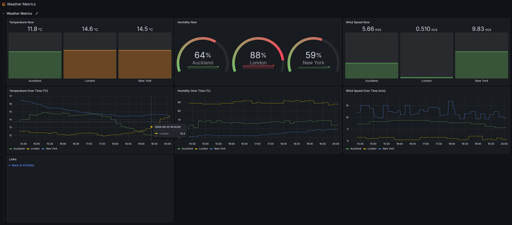
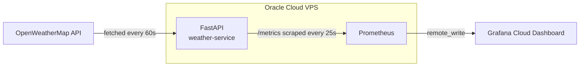

# Weather Metrics Dashboard Application

A FastAPI application that fetches weather data from a public API, uses Prometheus to expose the data as metrics, and visualizes it using Grafana Cloud.

## Live Links

- **API**: [https://vg-portfolio.duckdns.org/weather/](https://vg-portfolio.duckdns.org/weather/)
   - Health check: `/weather/health`
   - Current weather: `/weather/weather/{location}`
      - Example: `/weather/weather/London`
- **Grafana Dashboard**: [View the live dashboard](https://curiouspita1670.grafana.net/public-dashboards/55a83d63f07a4fb294889684e658c7d8)
- **Source code**: [github.com/v-galkin/weather-metrics](https://github.com/v-galkin/weather-metrics)

## Dashboard



## Tech Stack

- **FastAPI** — the async Python web framework the app is built on
- **httpx** — async HTTP client used to call the OpenWeatherMap API
- **APScheduler** — runs the periodic background job that fetches weather data
- **prometheus_client** — Python library used to define and expose Prometheus metrics
- **Prometheus** — scrapes the app's metrics and pushes them to Grafana Cloud via `remote_write`
- **Grafana Cloud** — hosts the dashboard that visualizes the metrics
- **Docker** + **Docker Compose** — containerizes the app, with separate configs for local dev and deployment
- **nginx** — reverse proxy on the VPS, shared across multiple projects
- **GitHub Actions** — runs tests and lint on every push and PR, and builds, pushes and deploys the image on pushes to `main`
- **pytest** — runs the automated test suite
- **ruff** — lints the codebase for style and common errors
- **black** — enforces consistent code formatting
- **Oracle Cloud VPS** — free-tier server that hosts the application, Prometheus and nginx
- **Let's Encrypt** + **Certbot** — issue the TLS certificate that serves the site over HTTPS
- **GitHub Container Registry (`ghcr.io`)** — stores the Docker image built by the pipeline, which the VPS pulls on deploy

## Flow Chart

The diagram below shows the overall data flow and does not include infrastructure layers such as the web server, reverse proxy or networking.



**Tracked locations:** London, Auckland, New York

Locations and the request timeout are currently hardcoded in `app/core/config.py` and cannot be changed without editing the code and redeploying.

## Design Decisions

### FastAPI over Django.
Django was the initial choice, but FastAPI was used instead because the project does not require a database or a model layer. In essence, the solution simply fetches data from the OpenWeatherMap API and forwards it to Grafana as Prometheus metrics.

### `httpx` over `requests`. 
The application uses `httpx` instead of `requests` because it needs to do two jobs at the same time: fetch weather data from the OpenWeatherMap API and expose it as Prometheus metrics. Since `requests` uses blocking HTTP calls, it would freeze the application while it waits for the API to respond.

### Prometheus scrapes every 25 seconds. 
Prometheus scrapes the application's metrics every 25 seconds to make sure a fresh value is captured within each one-minute interval, even if a single scrape fails. This creates some redundant samples between actual updates, but it increases reliability. The scrape interval can be tuned if needed.

### Layered structure 
The application uses a layered structure as below:
- `app/core`: Application's infrastructure. Includes the following modules:
   - `config`: Provides the application settings: OpenWeatherMap URL and API key, request timeout, and the list of tracked locations.
   - `exceptions`: Custom exceptions used throughout the application (`WeatherAPIError` and `LocationNotFoundError`).
- `app/weather`: Application's weather fetching and metrics logic. Includes the following modules:
   - `fetch`: Calls the OpenWeatherMap API for a location, checks the response, and returns temperature, humidity and wind speed.
   - `metrics`: Defines the Prometheus gauges (temperature, humidity, wind speed per location) and updates them with the fetched values.
   - `scheduler`: Runs a background job every 60 seconds that fetches all tracked locations and updates the metrics.
- `app/routers`: A thin HTTP layer on top. Includes the following modules:
   - `health`: `/health` endpoint to check that the application is running.
   - `weather`: `/weather/{location}` endpoint that returns current weather for a location.
   - `metrics`: `/metrics` endpoint that Prometheus scrapes.
- Each layer can be tested independently.
- The same `weather` logic is reused by both the API route and the background scheduler.

### Prometheus stays internal-only; Grafana runs on Grafana Cloud, not self-hosted.
The original plan was to self-host Grafana alongside the application. However, the free-tier Oracle Cloud server has only 1 GB of RAM and already runs other applications, while Grafana alone needs ~350 MB. To solve this, Grafana was removed from the server and the project now uses Grafana Cloud. Prometheus pushes its data there using `remote_write`, so it never needs to be exposed to the internet.

### Two separate `docker-compose` files
The application has two `docker-compose` files:
- `docker-compose-dev.yml`: Used for local development. The application runs at `localhost:8000` and Prometheus at `localhost:9090`.
- `docker-compose-deploy.yml`: Used for deployment. It does not expose any ports. Instead, it joins the shared `portfolio-network` so the nginx reverse proxy can reach the application. It also restarts the containers automatically after a server reboot and keeps Prometheus data in a persistent volume.

### No real API calls in tests.
The application has 14 tests. The fetch tests use `respx` to mock the OpenWeatherMap API, so the tests need neither a real API key nor network access.

The tests cover:

- **Fetching weather data**
  - parsing temperature, humidity and wind speed from the API response
  - a successful fetch
  - an unknown location, an invalid API key, a timeout, a server error and a connection error, each raising the correct custom exception
- **Metrics**
  - the Prometheus gauges being set to the fetched values
  - `/metrics` returning valid Prometheus output
- **API endpoints**
  - `/health` returning OK
  - `/weather/{location}` returning data, returning 404 for an unknown location, and returning 502 when the upstream API fails
- **Scheduler**
  - a failing location being skipped while the others are still updated

### Grafana Cloud alerting
Two alert rules are set up in Grafana Cloud:
- **Weather service down**: the `weather-service` scrape target has been unreachable for 2 minutes.
- **Weather data stale**: a location's temperature has not changed for 2 hours. Most likely, the fetch from OpenWeatherMap is failing even though the application is still running.

## CI/CD

Every push and pull request to `main` triggers a GitHub Actions pipeline (`.github/workflows/ci-cd.yml`) with four jobs:

1. **`test`** — installs dependencies and runs the `pytest` suite.
2. **`lint`** — runs `ruff check` and `black --check`, in parallel with `test`.
3. **`build-and-push`** — only runs on a push to `main` (not on pull requests), and only if `test` and `lint` succeed. Builds the Docker image and pushes it to GitHub Container Registry (`ghcr.io`), tagged `latest`.
4. **`deploy`** — runs after `build-and-push`, on pushes to `main` only. Connects to the VPS over SSH, pulls the latest repo and image, recreates the containers with `docker compose`, then checks that `/weather/health` responds.

The VPS pulls the published `ghcr.io` image, so the server never builds anything itself. The deploy job connects over SSH using credentials stored as GitHub Actions secrets:
   - `VPS_SSH_KEY`
   - `VPS_HOST`
   - `VPS_USER` 

Secrets such as the OpenWeatherMap API key and the Grafana Cloud token live only on the server and are never committed to the repository.

## Running Locally

To run the application you need your own OpenWeatherMap API key, which you can get free of charge at [openweathermap.org/api](https://openweathermap.org/api).

Create a `.env` file in the project root and add:
```
OPENWEATHER_API_KEY=your_key_here
```

**Note:** The steps below do not set up Grafana. Locally you can view the metrics at `/metrics` (both options) or in the Prometheus UI (Option 1 only). To visualize them, import the dashboard backup at `grafana/weather-metrics.json` into your own Grafana instance.

There are two ways to run the project.

### Option 1: Docker Compose (application and Prometheus)
1. Create an empty file named `grafana-cloud-token.txt` in the project root. The compose file mounts it, and Prometheus uses it to push data to Grafana Cloud. Without a real token, the push fails with a `401` error in the Prometheus logs. This is harmless: scraping and the local Prometheus UI still work.
   Alternatively, remove the `remote_write` section from `prometheus.yml`.
2. Start the containers:
   ```
   docker compose -f docker-compose-dev.yml up --build
   ```
3. Open the services:
   - Application: `http://localhost:8000` (for example `/weather/London` and `/metrics`)
   - Prometheus: `http://localhost:9090`

### Option 2: Python virtual environment (application only)
This runs only the FastAPI application, without Prometheus. Metrics are still available at `http://localhost:8000/metrics`.

1. **Create a virtual environment**
   ```
   python -m venv venv
   ```
2. **Activate it**

   Windows:
   ```
   venv\Scripts\Activate.ps1
   ```
   Ubuntu / macOS:
   ```
   source venv/bin/activate
   ```
3. **Install dependencies**
   To run the service:
   ```
   pip install -r requirements.txt
   ```
   For development:
   ```
   pip install -r requirements-dev.txt
   ```
4. **Run the application**
   ```
   uvicorn app.main:app --reload
   ```
5. **Run the tests**
   ```
   pytest -v
   ```